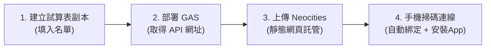

# 🎯 班級智慧作業清點、缺交催繳與錯題訂正系統 (PWA 雙模式強化版)

> 一套專為國小導師與任課教師設計的智慧班級作業管理系統。支援 **純按鈕快速點收**、**手機 QR Code 速掃**、**全班缺交催繳矩陣** 以及 **錯題訂正銷案矩陣**。  
> 具備 **PWA 獨立 App 全螢幕模式**、**手機 QR Code 一秒自動連線配對** 以及 **背景自動偵測升級** 功能！

---

## 🚀 系統快速安裝與部署教學 (5 分鐘輕鬆搞定)



---

### 步驟 1：建立試算表副本與設定學生名單
請點擊下方連結，在您的 Google 雲端硬碟建立系統試算表副本：

👉 **[點我建立試算表副本 (Google Sheets Copy Link)](https://docs.google.com/spreadsheets/d/1O7rwisRcjLcclZRDfHoGjGl7y8Nk9R9orQuhJqMfkd0/copy)**

> 📌 **學生名單與空號扣減設定說明**：
> 1. **學生名單設定**：使用前，請在副本 Google Sheets 的 **`工作表1`** 上「學生姓名」欄位填入貴班學生的姓名。
> 2. **預設人數**：系統預設上限為 **30 人**（座號 01 ~ 30 號）。
> 3. **空號/轉出設定**：若貴班人數少於 30 人，或中間有轉學/缺號座號，請在該座號姓名處填入 **`空號`**（或 **`轉出`**）。
> 4. **自動隱藏與人數扣減**：姓名處若填入「空號」，系統該座號即**不顯示按鈕**，全班總人數也會**自動減少一人**。

---

### 步驟 2：新增 Google Apps Script (GAS) 部署作業
1. 開啟剛剛建立的試算表副本。
2. 點選上方選單 **「擴充功能」 ➔ 「Apps Script」**。
3. 點擊右上角藍色的 **「部署」 ➔ 「新增部署作業」**。
4. 部署設定如下：
   * **選取類型**：點擊齒輪圖示，選擇 **「網頁應用程式」 (Web App)**
   * **說明**：可自由輸入（如：`班級作業系統正式版`）
   * **執行身份** (Execute as)：選擇 **`我 (您的 Google 帳號)`**
   * **誰有存取權** (Who has access)：選擇 **`所有人 (Anyone)`**
5. 點擊 **「部署」** 按鈕，依照畫面指示完成 Google 帳號權限授權。
6. 部署成功後，畫面會顯示 **「網頁應用程式網址」 (Web App URL)**，請點擊 **「複製」** 備用（格式如：`https://script.google.com/macros/s/AKfycb.../exec`）。

> 🎉 **電腦端已可直接使用**：  
> 直接在電腦瀏覽器開啟剛剛複製的網址，即可在電腦大螢幕上使用「純按鈕作業點收與缺交催繳矩陣」！

---

### 步驟 3：上傳 Neocities 免費網頁空間（支援手機相機與 PWA）
由於 Google 原生 GAS 的安全政策會封鎖手機相機權限 (`getUserMedia`)，凡需在手機上使用相機掃碼或安裝為 PWA App，請使用 **[Neocities (neocities.org)](https://neocities.org/)** 免費靜態網頁託管服務。

#### 3-1. 註冊 Neocities 帳戶
1. 前往 [Neocities 官網](https://neocities.org/) 免費註冊帳號。
2. 登入後點擊 **「Edit Sites」** 進入檔案管理介面。

#### 3-2. 上傳 `neocities/` 資料夾內全部檔案（**無需修改任何程式碼**）
直接將本專案 `neocities/` 資料夾內的所有檔案原封不動上傳至 Neocities 空間根目錄或 `/scanner/` 資料夾中：

| 檔案名稱 | 說明 / 功能 |
|---|---|
| **`index.html`** | 🎯 純按鈕作業點收、單元設定與全班缺交催繳矩陣主頁 |
| **`scanner.html`** | 📱 作業 QR Code 速掃工具 (相機高速辨識，附「🎯 純按鈕清點」無縫切換按鈕) |
| **`correction.html`** | ✏️ 班級作業錯題訂正與銷案矩陣主頁 |
| **`correction_scanner.html`** | 📷 獨立訂正掃碼工具 (橫向雙欄，相機即掃即銷案) |
| **`StickerGenerator.html`** | 🏷️ 班級學生作業條碼 / QR Code 貼紙產出與列印工具 |
| **`manifest.json`** | 📲 PWA 應用程式設定檔（定義 App 捷徑、橫向模式與圖示） |
| **`sw.js`** | ⚡ PWA Service Worker（快取離線資源，負責背景自動偵測新版本更新） |
| **`icon.svg` / `icon-192.png` / `icon-512.png`** | 🎨 App 桌面圖示 |

---

### 步驟 4：手機秒速掃碼配對（免手動貼網址）與安裝 PWA App

系統已全面升級為**智慧 QR Code 配對技術**，再也不需要手動複製貼上落落長的 GAS 網址！

1. **電腦端開啟配對視窗**：
   在電腦瀏覽器打開剛剛的系統主頁（GAS 部署網址或 Neocities `index.html` 皆可），點擊右上角藍色按鈕 **「📱 手機掃碼連線」**。
2. **選擇您要使用的工具**：
   在彈出視窗上方點選您想在手機上使用的功能（預設為「📥 作業收繳速掃」）。
3. **手機相機一掃即連**：
   拿起手機打開**內建相機**，對準電腦螢幕上的 QR Code 掃描開啟。
   - ✨ **自動完成綁定**：網頁開啟時已自動完成 `GAS_API_URL` 綁定，全站各功能（速掃、按鈕點收、錯題訂正）全域共享，免手動設定！
4. **一鍵安裝為 PWA App**：
   - 點擊網頁頂部藍色的 **「📲 安裝 App」** 按鈕（或點擊手機瀏覽器選單「**加入主畫面**」）。
   - 手機桌面即會產生獨立的「作業管理」App 圖示，點開即享全螢幕橫向鎖定、無瀏覽器網址列干擾的原生 App 體驗！

---

## ⚡ 獨家功能：PWA 自動偵測更新機制（免下拉重新整理）

針對手機 PWA「獨立應用程式模式（Standalone）」預設鎖定下拉手勢的問題，系統內建 **雙重背景檢查更新機制**：

1. **切回前台自動檢查**：每次解鎖手機螢幕或切換回本 App 時，自動在背景詢問 Neocities 伺服器是否有新版本。
2. **浮動更新提示列**：一旦伺服器有檔案改版，畫面正上方會自動浮出溫馨提示：  
   👉 **「✨ 發現系統新版本！【立即套用更新】」**
3. 老師只需輕點一下按鈕，App 就會在 0.3 秒內自動完成快取刷新並套用最新代碼，輕鬆無痛升級！

---

## 💡 實務操作與高效掃碼工作流程建議 (Best Practice Workflow)

為了達到全班作業點收與錯題銷案最高效率，推薦採用以下經實務驗證的最順暢工作流程：

1. **標籤列印與裁切**：使用 `StickerGenerator.html` 產生全班條碼/QR Code 貼紙後，以 **A4 紙張** 列印，再以 **鋼尺與美工刀** 快速裁切標籤。
2. **標籤張貼位置**：將裁切好的 QR Code 貼紙統一黏貼於作業本的 **右上角**。
3. **雙手流順暢掃描操作**：
   * **右手**：橫向握持手機將鏡頭對準作業本右上角（全靜音運作，內建綠光邊框與震動回饋，不打擾教室秩序）。
   * **左手**：順手快速翻頁或替換下一本作業本。
   * 遇到缺交或要登記單元頁數時，點擊頂部 **「🎯 純按鈕清點」** 隨時切換至號碼輸入介面！

---

## 🌐 系統頁面開啟與存取對照表

| 系統頁面 / 工具名稱 | 推薦存取方式與網址 | 運作說明 |
|---|---|---|
| **🎯 純按鈕作業點收與催繳主頁** | `https://您的帳號.neocities.org/index.html` 或 GAS 原生網址 | 支援科目種類單元備註挑選、號碼點收與全班催繳矩陣 |
| **📥 作業 QR Code 速掃工具** | `https://您的帳號.neocities.org/scanner.html` | 手機相機極速辨識，附「🎯 純按鈕清點」切換按鈕 |
| **✏️ 錯題訂正與銷案矩陣主頁** | `https://您的帳號.neocities.org/correction.html` | 錯題登記、銷案矩陣與全班催繳總覽 |
| **📱 獨立訂正條碼速掃工具** | `https://您的帳號.neocities.org/correction_scanner.html` | 橫向雙欄設計，相機即掃即銷案 |
| **🏷️ 條碼與 QR Code 貼紙產生器** | `https://您的帳號.neocities.org/StickerGenerator.html` | 批量排版產生全班標籤，支援 A4 直接列印 |

---

## ✨ 系統主要功能特色

### 1. 🎯 純按鈕作業點收與防呆提醒
* **未選擇項目防呆攔截**：剛進入頁面若未選擇【科目 | 種類】，按壓座號按鈕會自動跳出視覺化彈窗提醒，防止誤觸點收。
* **一鍵狀態切換**：選定作業後，自動載入當日點收紀錄，點擊號碼即可切換 `🟢 已繳` / `🔴 未繳`。
* **豐富科目種類支援**：
  * **國語**（甲本、乙本、習作、圈詞、預習單、學習單、國練、評量、考卷、作業本）
  * **數學**（數習、數課、數練、學習單、評量、考卷、作業本）
  * **社會、自然、英語**（習作、預習單、學習單、評量、考卷、作業本）
  * **聯絡簿、日記**
  * **單據**（同意書、回條、繳費單）
  * **其它**（其它）

### 2. 📱 手機 QR Code 條碼速掃與錯題銷案
* **純靜音無干擾**：教室掃碼以無聲為最高境界，搭配畫面綠光閃爍與手機微震動反饋。
* **條碼相機掃描**：支援手機鏡頭直接掃描學生條碼（相容座號純數字、`座號|科目|種類` 或 `CMS|座號|科目|種類` 格式）。
* **雙模式切換**：
  * 🟧 **登記錯題模式 (標為 X)**：快速標記學生需要訂正的作業，並新增至訂正矩陣。
  * 🟦 **錯題銷案模式 (標為 O)**：學生訂正完成後，掃碼即可將錯題銷案。
* **三層式焦點鎖定機制**：掃碼完成後，下拉選單與燈號矩陣 100% 精準鎖定至該作業，絕不意外跳回第一筆。

### 3. 📊 全班缺交與錯題催繳矩陣
* **即時催繳清單**：自動彙整全班缺交學生與待訂正錯題項目。
* **科目篩選與批次補登**：支援依所有科目頁籤進行快速篩選，並提供全選與「✅ 批次送出補登」功能。

---

## 📱 學生條碼格式說明 (Barcode Format)

系統相容以下三種條碼格式（可使用 `StickerGenerator.html` 直接產生標籤貼紙貼在學生作業本上）：

| 條碼格式 | 範例 | 說明 |
|---|---|---|
| **純座號** | `09` | 登錄/銷案 09 號學生當前選取的作業 |
| **座號+作業** | `09\|數學\|數課` | 登錄/銷案 09 號學生的「數學 數課」 |
| **CMS 前綴格式** | `CMS\|09\|數學\|數課` | 完整班級系統標準格式 |

---

## 📁 專案檔案架構

```text
├── gas-project/               # 💻 Google Apps Script 後端專案核心 (clasp 部署用)
│   ├── appsscript.json        # GAS 專案組態檔
│   ├── Code.gs                # 後端 API 與試算表讀寫邏輯 (支援 getGasWebAppUrl、批次補登)
│   ├── Index.html             # 🎯 純按鈕作業點收與催繳矩陣主頁 (GAS 原生直接開啟)
│   ├── Scanner.html           # 📱 作業速掃頁面 (附直連純按鈕按鈕)
│   ├── Correction.html        # ✏️ 錯題訂正矩陣頁面
│   ├── CorrectionScanner.html # 📷 訂正條碼速掃頁面
│   └── StickerGenerator.html  # 🏷️ 標籤貼紙產生器
├── neocities/                 # 🌐 上傳至 Neocities 的完整 PWA 靜態站點
│   ├── index.html             # 🎯 純按鈕作業點收與催繳矩陣主頁 (外部 PWA 版)
│   ├── scanner.html           # 📥 作業速掃點收工具 (相機即掃即登)
│   ├── correction.html        # ✏️ 錯題訂正與銷案矩陣主頁
│   ├── correction_scanner.html# 📱 獨立訂正掃碼工具 (橫向雙欄)
│   ├── StickerGenerator.html  # 🏷️ 條碼與 QR Code 標籤貼紙產生器
│   ├── manifest.json          # 📲 PWA 應用程式設定與捷徑定義
│   ├── sw.js                  # ⚡ Service Worker 快取與自動更新偵測
│   ├── icon.svg               # 🎨 向量 App 圖示
│   ├── icon-192.png           # 🎨 192x192 PWA 圖示
│   └── icon-512.png           # 🎨 512x512 PWA 圖示
└── README.md                  # 📖 專案安裝與說明文件
```

---

## 📄 授權條款 (License)

本專案採用 [MIT License](LICENSE) 授權開放，歡迎各位老師自由建立副本、修改與分享！
